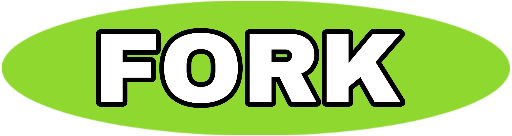

 
  <a href="#">
  <marquee> <h1>New Update is coming soon!!!</h1></marquee>
    </img>
    

      
    

    

      
      
    

    

      
      
      
      
      

### Please Read!
Hi guys, deploy DilaMD bot and enjoy using it.

[Contact the support group](https://t.me/dilalk) for any issues that arise during the bot creation process. 

### `VERSION: V1`

#### GitHub Repository
[Follow Me on GitHub](https://github.com/themiyadilann/Dila-MD)

## How to create DILAMD.
**1. You must have these things before deploying:**
- _GitHub Account._
- _MongoDB URL (sign up and get MongoDB URL)._
- _Host._

**2. Deploy steps:**
- _Fork the  DILA MD repository._
- _Link with your WhatsApp using Scan QR code or Pair code._
- _Open `config.js` on your forked repository. Add `SESSION_ID` and `MONGODB_URL`_
- _Deploy using your host._

## 1. FORK REPOSITORY

## 2.Click Deploy Button For Deploy & More Information !
  <a href="https://cyberdeadzoteam.vercel.app/" class="btn">Deploy</a>
 
 ## Meet The Develovers 

  <button onclick="window.location.href='https://wa.me/94777839446?text=dilo'">
                
 

