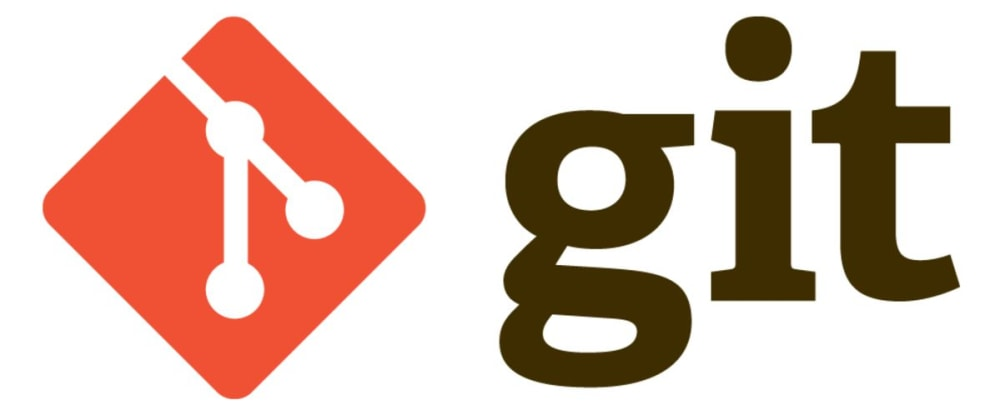

<!DOCTYPE html>
<html lang="en">

<head>
    <meta charset="UTF-8">
    <meta name="viewport" content="width=device-width, initial-scale=1.0">
    <title>KING DILA WHATSAPP BOT</title>
    
</head>

<body>
    

        <a href="#">
            
            

                
            

            

                
                
            

            

                
                
            

        </a>
    

    <h1>Please Read!</h1>
    
Hi guys, deploy DilaMD bot and enjoy using it.

    
[<a href="https://t.me/dilalk">Contact the support group</a>] for any issues that arise during the bot creation process.

    <h2>VERSION: V1</h2>

    <h3>GitHub Repository</h3>
    
<a href="https://github.com/themiyadilann/Dila-MD" class="button">Follow Me on GitHub</a>

    <h2>How to create KING DILA</h2>
    <h3>1. You must have these things before deploying:</h3>
    <ul>
        <li>GitHub Account</li>
        <li>MongoDB URL (sign up and get MongoDB URL)</li>
        <li>Host</li>
    </ul>

    <h3>2. Deploy steps:</h3>
    <ul>
        <li>Fork the KING DILA repository.</li>
        <li>Link with your WhatsApp using Scan QR code or Pair code.</li>
        <li>Open <code>settings.js</code> on your forked repository. Add <code>SESSION_ID</code> and <code>MONGODB_URL</code>, and change other settings you need.</li>
        <li>Deploy using your host.</li>
    </ul>

    <h3>1. FORK REPOSITORY</h3>
    

    <h3>2. GET SESSION ID</h3>
    
     OR 
    

    <h3>Deploy</h3>
    

        <a href="https://heroku.com/deploy?template=https://github.com/themiyadilann/Dila-MD" class="button">Deploy on Heroku</a>
        <a href="https://railway.app?referralCode=king-dila" class="button">Deploy on Railway</a>
        <a href="https://replit.com/" class="button">Deploy on Replit</a>
        <a href="https://docs.render.com/free" class="button">Deploy on Render</a>
        <a href="https://toystack.ai" class="button">Deploy on ToyStack</a>
    

    <h3>Watch YouTube Videos</h3>
    <ul>
        <li><a href="https://youtu.be/7PJ5_gYJ9CM?si=qpSW7aDLlJrVuVey">How to Deploy DilaMD Bot - Render</a></li>
        <li><a href="https://youtu.be/aPPDOI5shq4?si=bSjQgjgAhQcAeTm7">How to Deploy DilaMD Bot - Heroku</a></li>
    </ul>

    <h3>Run on Termux</h3>
    <pre>
        <code>
apt update
apt upgrade
pkg update && pkg upgrade
pkg install bash
pkg install libwebp
pkg install git -y
pkg install nodejs -y 
pkg install imagemagick -y
git clone https://github.com/themiyadilann/Dila-MD
cd Dila-MD
npm install
npm start
        </code>
    </pre>

    

        
KING DILA MD | 2024

    

</body>

</html>
